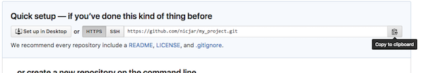

#  Version control

## Preparations

If you haven't done so already, make sure that you do all preparatory steps described in [Preparations]({{site.url}}/preparations.html)
 

## Working with git in SourceTree

#### :computer: Add your project directory to SourceTree

:key: Click to see hints

* _Clone / New_ -> _Create New Repository_ tab
	* **Repository Type**: Git
	* **Destination path**: path to your directory (can be selected by using the ... button)
	* Check the _Bookmark this repository_ option
	* **Name**: directory name (or what you want)
* At the next dialog, add your name and email address (preferable the same that you used when you registered your GitHub account)
	* Check the _Use these details for all repositories_ option@

  
 

#### :computer: Do an initial commit of your files

:key: Click to see hints

* Open your project repository in SourceTree
* On the lefthand panel of your project, select FILE STATUS - Working Copy
* Select the files listed under 'Unstaged files' and click _Stage selected_
* Type an short and informative message in the commit message text field at the bottom, e.g. `Initial commit`
* Hit commit button
* (Expand the BRANCHES tab on the left, and select the master branch to see what was committed)

  
 

#### :computer: Edit one of the files, and commit the change

:key: Click to see hints

* Select the changed file listed under 'Unstaged files', and view the changes that has been made
* Type an short and informative message in the commit message text field at the bottom, e.g. `Added more information about this or that`
* Hit commit button
* (Expand the Branches tab on the left, and select the master branch to see what was committed)

  
 

#### :computer: Add a file to your project that you don't want to commit to git.
For example, this could be a dataset file that you don't want to make public yet, e.g. `my_project/data/raw/2016-11-16/bryceveg.R`. Make git ignore this file.

:key: Click to see hints

* Add a file somewhere in your project directory
* Right-click the recently added file (listed under 'Unstaged files'), and select the _Ignore..._ choice.
	* Select an appropriate available option, and click OK
* Notice that a new file _.gitignore_ has appeared. Add and commit that file to your repository.

  
 

## Working with a GitHub remote repository

#### :computer: Create a new repository on [GitHub](https://github.com)

:key: Click to see hints

* Go to GitHub, and log in to your account
* Click the _Start a project_ or the _New repository_ button
  * Give the the repository the same name as the folder on your computer
    * _You can name it anything you want, but it's usually easier to understand what's going on if they are called the same thing_
  * Add a description if you want to
  * Select _Public_ or _Private_. (If you want to make it Private, what's your reason for this?)
  * Ignore the rest of the choices
  * Click the _Create repository_ button
* Copy the link shown under _Quick setup_ on the next page

* In SourceTree, click _Settings_ (on the top right).
  * then _Remotes_ tab, _Add_ button
  * Check the _Default remote_ choice
  * In _URL / Path_, paste the link that you copied from GitHub
  * Add your GitHub username
* To **push** your local repository state to the remote repository on GitHub, click the _Push_ button in the toolbar at the top
  * Check the _master_ branch choice, and click the _Push_ button
  * Submit username and password in the _Authenticate_ dialog that pops up
  * _You should now see two branch names in the commit history: **master** and **origin/master**_
* Go back to GitHub and check that you can see your repository. (Click the name of the repository at the top, or the _Code_ tab)
	* Also notice that the file you told git to ignore in the previous task is not present in the remote repository

  
 

#### :computer: Make a change to your repository locally, e.g. by modifying or adding a file. Commit your changes to both the local and remote repositories

:key: Click to see hints

* After changing some file, stage the file as usual.
* Check the _Push changes immediately to origin/master_ choice below the commit message text field, Click the _Commit_ button

  
 

#### :computer: Recover an earlier state.
1. Delete one of the files in your repository
2. Commit the change
3. Now try to recover the state before the file was deleted.

_This is a bit tricky..._

:key: Click to see hints

_This can be done in many different ways..._
If you want to go back to a previous commit one step back, the easiest way is to
* Right-click the last commit and select _Reverse commit_

Otherwise you can use branches:
* Check out a new branch (_Branch_ button at the top)
	* Base it on the commit that had the deleted file
	* Name the branch to something useful, e.g. _recover_
	* Check that you get the file back
	* Change something in your repository (e.g. add a space to a file)
		* Note that the two branches have separated.
* Merge the recover branch with the _master_ branch:
	* Switch back to the **_master_** branch by double-clicking _master_ under BRANCHES
	* Click _Merge_ at the top
	* Select the latest commit on the _recover_ branch, and click OK. _Pray..._

  
 
