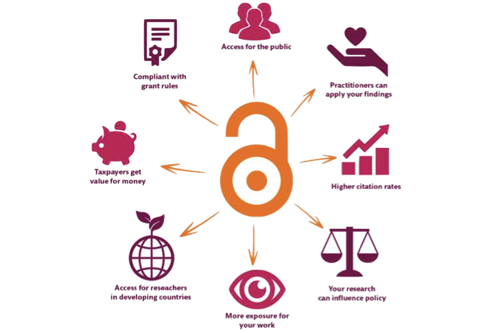

## Caveat {.flexbox .vcenter}

<b>You are guinea pigs!</b>

## The day {.smaller}

- Introduction to data management
- File organisation best-practices
    - <em>Hands-on session</em>
- Version control — introduction to git and GitHub
    - <em>Hands-on session</em>

-- <b><em>Lunch</em></b> --

- Notebooks - R notebook
    - <em>Hands-on session</em>
- Data publishing
- Collaborative environments
    - <em>Hands-on session</em>

# Introduction to Data Management {.smaller}

## Why manage research data?

* To make your research easier!
* To stop yourself drowning in irrelevant stuff
* In case you need the data later
* To avoid accusations of fraud or bad science
* To share your data for others to use and learn from
* To get credit for producing it
* Because funders or your organisation require it

Well-managed data opens up opportunities for re-use, integration and new science

  

There are lots of reasons to manage research data. Ultimately though, it’s to make your research easier.

If data are properly documented and organised, you can stop yourself drowning in irrelevant stuff and find the data when you need it – for example to validate findings.

By managing your data you can also more easily share it with others to get more credit and impact.

You may also be required to explain how you will manage your data by your funder or university.

## Open Access to research data {.smaller}

- The practice of providing on-line access to scientific information that is free of charge to the end-user and that is re-usable.
    - Does not necessarily mean unrestricted access, e.g. for sensitive personal data
- Strong international movement towards Open Access (OA)
- European Commission recommended the member states to establish national guidelines for OA
    - Swedish Research Council (VR) submitted proposal to the government last year

  

  

  

## Why Open Access {.smaller}

- Democracy and transparency
    - Publicly funded research data should be accessible to all
    - Published results and conclusions should be possible to check by others
- Research
    - Enables others to combine data, address new questions, and develop new analytical methods
    - Reduce duplication and waste
- Innovation and utilization outside research
    - Public authorities, companies, and private persons outside research can make use of the data
- Citation
    - Citation of data will be a merit for the researcher that produced it

