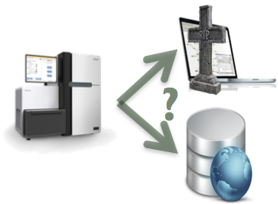
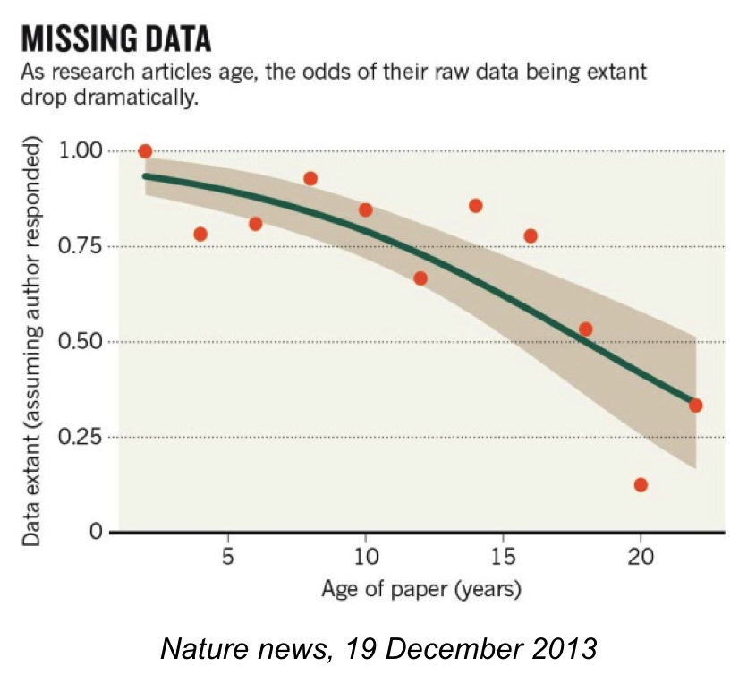
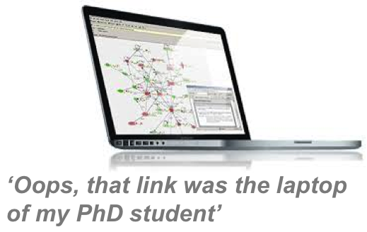
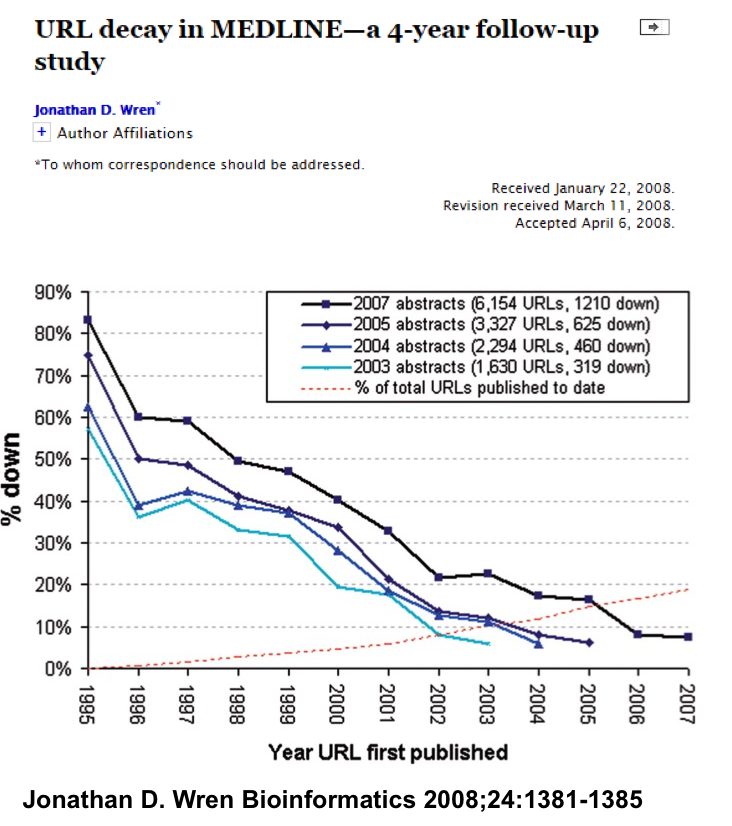
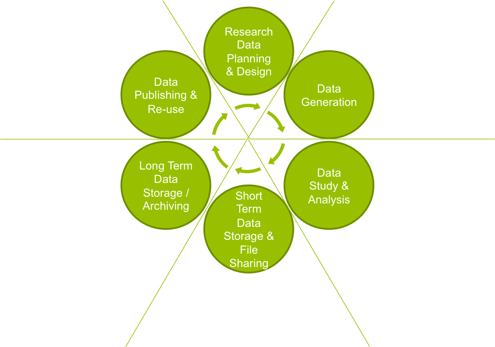
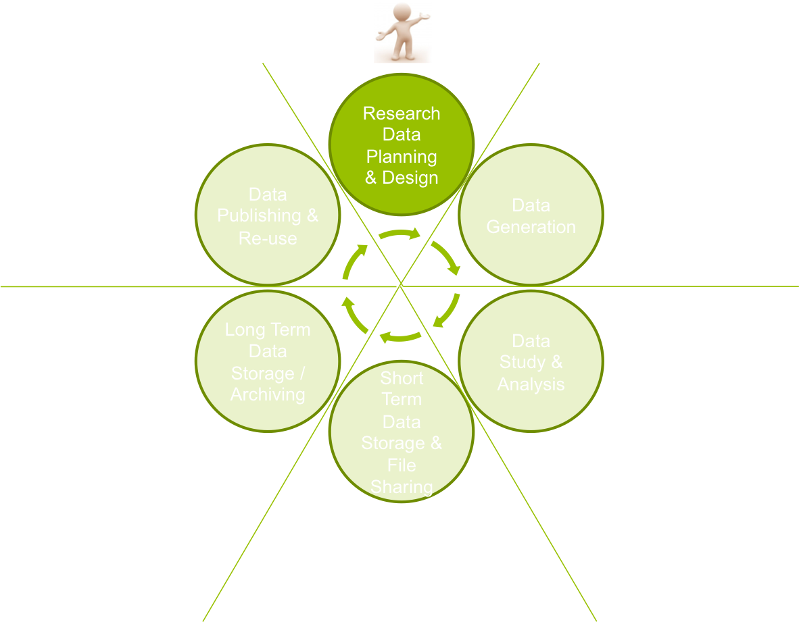
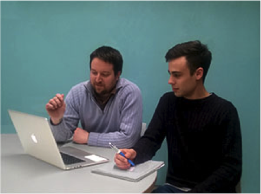

----

## Caveat {.flexbox .vcenter}

<b>You are guinea pigs!</b>

## The day {.smaller}

- Introduction to data management
- File organisation best-practices
    - <em>Hands-on session</em>
- Version control — introduction to git and GitHub
    - <em>Hands-on session</em>

-- <b><em>Lunch</em></b> --

- Notebooks - R notebook
    - <em>Hands-on session</em>
- Data publishing
- Collaborative environments
    - <em>Hands-on session</em>

# Introduction to Data Management {.smaller}

## Why manage research data?

* To make your research easier!
* To stop yourself drowning in irrelevant stuff
* In case you need the data later
* To avoid accusations of fraud or bad science
* To share your data for others to use and learn from
* To get credit for producing it
* Because funders or your organisation require it

Well-managed data opens up opportunities for re-use, integration and new science

  

There are lots of reasons to manage research data. Ultimately though, it’s to make your research easier.

If data are properly documented and organised, you can stop yourself drowning in irrelevant stuff and find the data when you need it – for example to validate findings.

By managing your data you can also more easily share it with others to get more credit and impact.

You may also be required to explain how you will manage your data by your funder or university.

## Open Access to research data {.smaller}

- The practice of providing on-line access to scientific information that is free of charge to the end-user and that is re-usable.
    - Does not necessarily mean unrestricted access, e.g. for sensitive personal data
- Strong international movement towards Open Access (OA)
- EC recommended the member states to establish national guidelines for OA
    - Swedish Research Council (VR) submitted proposal to the government last year

  

  

  

## Why Open Access {.smaller}

- Democracy and transparency
    - Publicly funded research data should be accessible to all
    - Published results and conclusions should be possible to check by others
- Research
    - Enables others to combine data, address new questions, and develop new analytical methods
    - Reduce duplication and waste
- Innovation and utilization outside research
    - Public authorities, companies, and private persons outside research can make use of the data
- Citation
    - Citation of data will be a merit for the researcher that produced it

## Data loss {.smaller}

_Slide stolen from Barend Mons_

## Data persistency issues

Several studies have also shown issues with data persistence. This graph shows how many broken links there are in a selection of MEDLINE papers. The further back you go, the higher the percentage, and worryingly, the highest percentage is for the most recent papers (abstracts from 2007).

Another issue that occurs is reference rot, where the link still resolves, but the content presented no longer reflects the original content cited as the webpage has been updated.

## The Research Data Life Cycle

## Planning & Design

## Planning & Design {.smaller}
- Data Management planning
    - Data types
        - Sizes, were to store, etc
    - **Metadata**
        - Use standards!
            - _But not always straight-forward..._ 
            - (http://www.dcc.ac.uk/resources/metadata-standards/disciplinary/ecology)

- **Data Management Plans**
    - Will become a standard part of the research funding application process 
    - What will be collected?, Organized?, Documented?, Stored and preserved?, Disseminated?, Policies?, Budget?

## Source acknowledgements
- Research Data Management, EUDAT - http://hdl.handle.net/11304/79db27e2-c12a-11e5-9bb4-2b0aad496318
- Barend Mons – FAIR Data

