## Study & Analysis

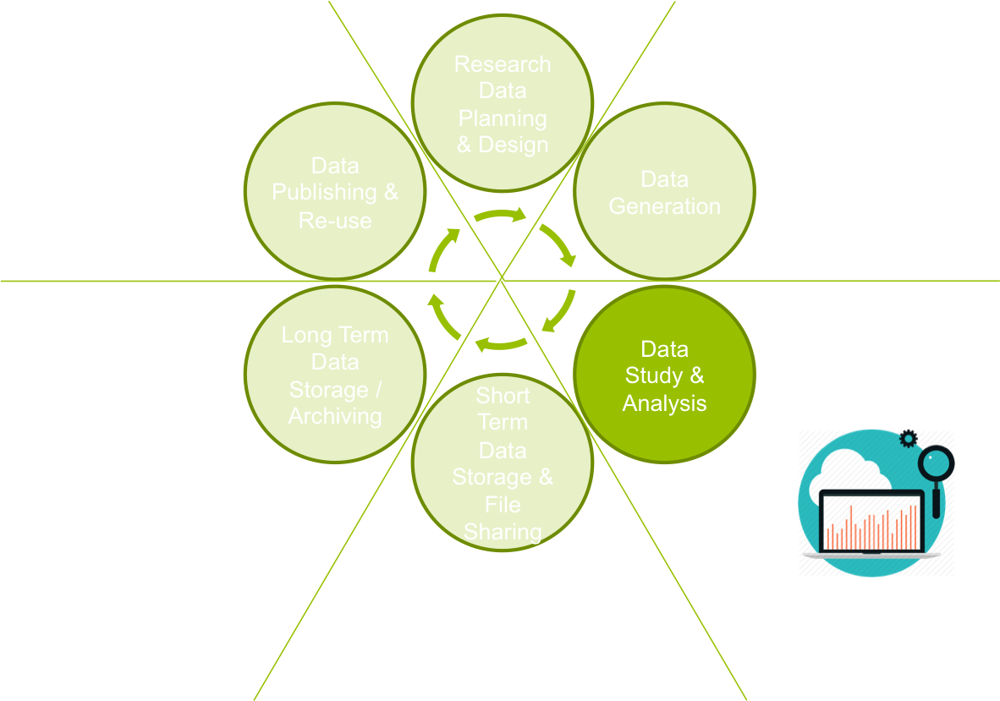

## Study & Analysis
- Principles
    - _“Someone unfamiliar with your project should be able to look at your computer files and understand in detail what you did and why.”_
    - _"Everything you do, you will have to do over and over again”_ 
    – Murphy’s law

- Structuring data for analysis
    - Poor organizational choices lead to significantly slower research progress.
    - It is critical to make results reproducible.

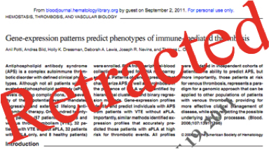

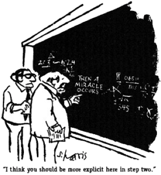

## A reproducibility crisis
- Nature special issue
    - http://www.nature.com/news/reproducibility-1.17552 
- Several studies have shown alarming numbers of published papers that don’t stand up to scrutiny

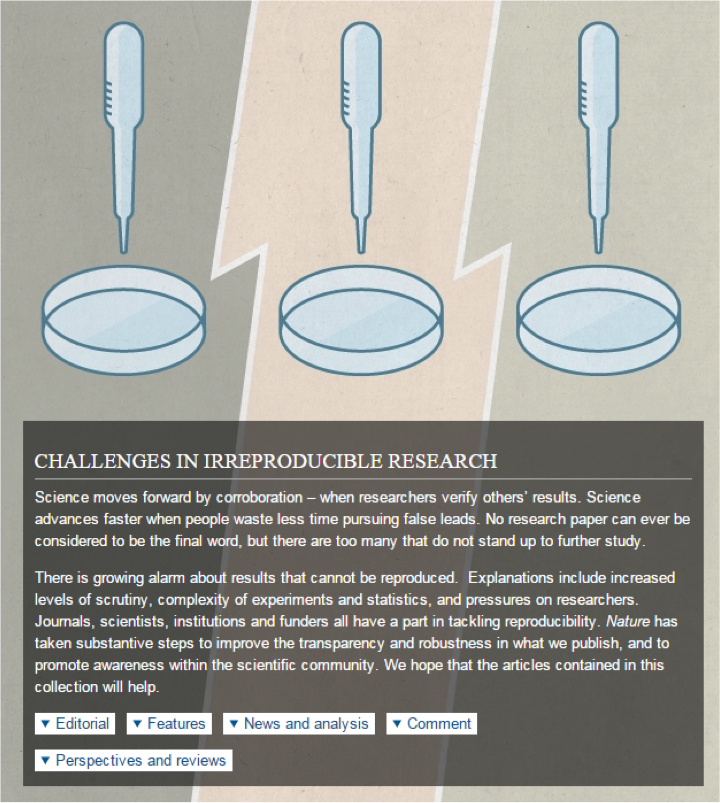

## Organisation - _So far, so good…_

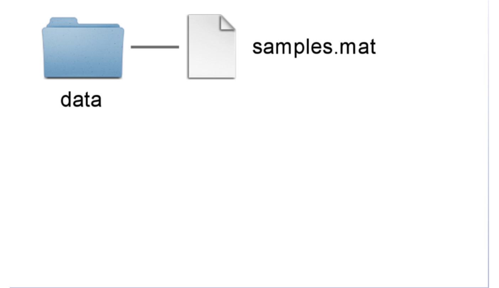

## _Now what?_

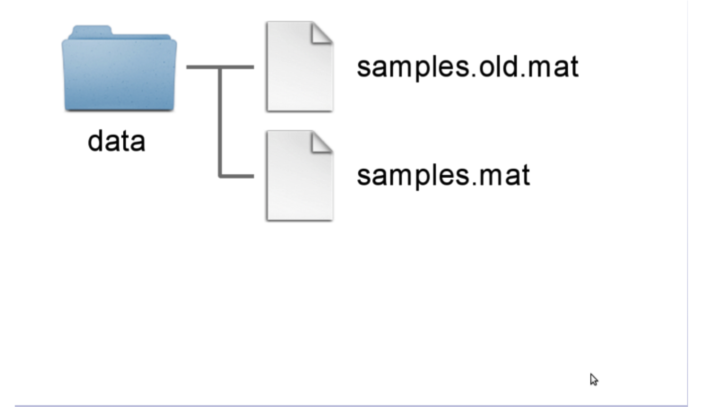

## _I guess this is alright...

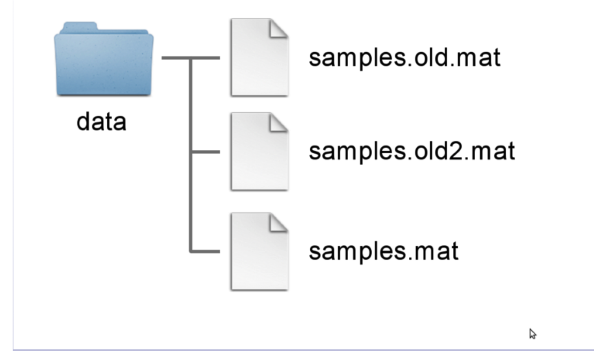

## _Which one is the most recent?_

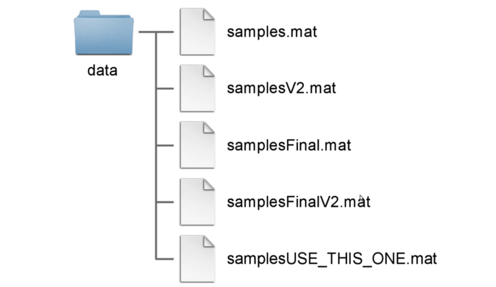

## Another (bad) common approach

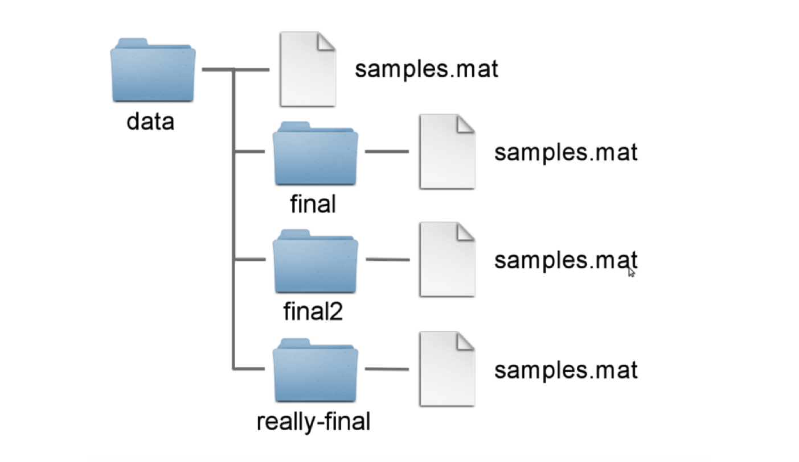

## A possible solution

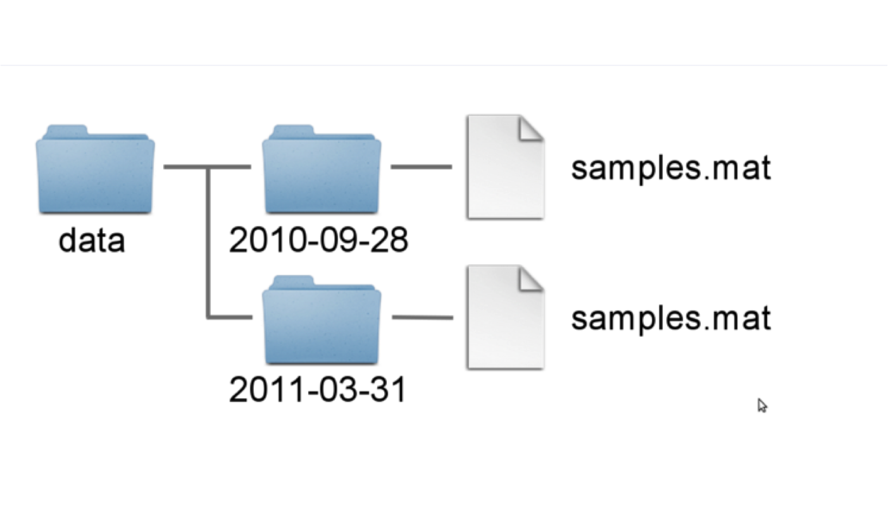

## Still missing something
- Need context **=>** document **metadata**
    - How was the data generated?
    - From what was the data generated?
    - What where the (experimental) conditions?
    - Etc, etc, ...

## Some suggested best-practices
- There is a **folder for the raw data**, which do not get altered, or intermixed with data that is the result of manual or programmatic manipulation. I.e., derived data is kept separate from raw data, and **raw data is not duplicated**.
- **Code is kept separate from data**.
- There is a **scratch directory for experimentation**. Everything in the scratch directory can be deleted at any time without negative impact.
- There should be a **README in every directory**, describing the purpose of the directory and its contents.
- **Manuscript production** output is kept separate from everything else.
- Use **non-proprietary formats** – .csv rather than .xlsx
- Etc…

## Non-proprietary formats
- A **text-based** format is more future-safe, than a proprietary binary format by a commercial vendor
- Never, never, never use Excel for _science_!
- **Markdown** is a nice way of getting nice output from text.
    - Simple & readable formating
    - Can be converted to lots of different outputs
        - HTML, pdf, MS Word, slides etc

## Directory structure {.smaller}
Noble WS (2009) A Quick Guide to Organizing Computational Biology Projects. PLoS Comput Biol 5(7): e1000424. [doi:10.1371/journal.pcbi.1000424](http://journals.plos.org/ploscompbiol/article?id=info:doi/10.1371/journal.pcbi.1000424)

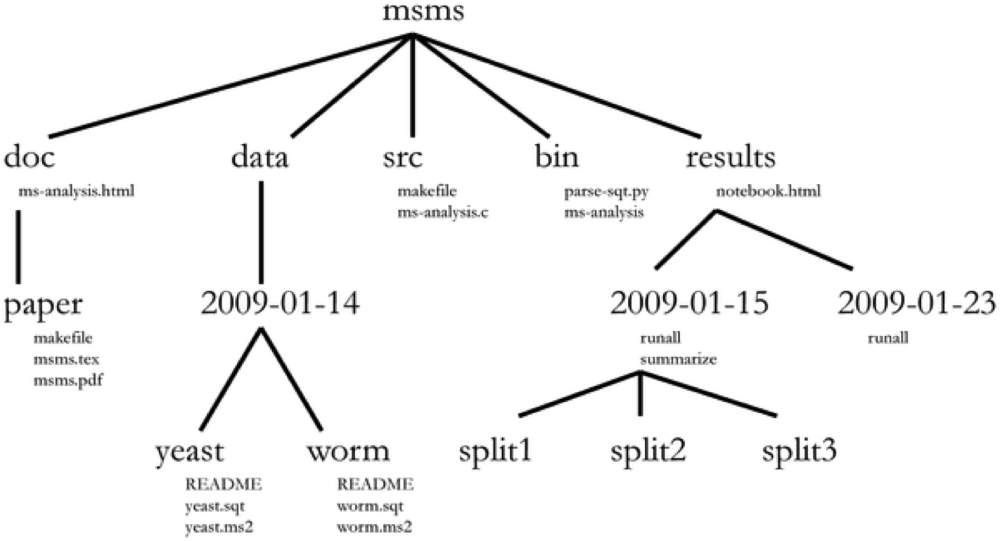

## Or like this… {.smaller}
~~~~
├── bin  <---------------# Binary files and executables (jar files & proj-wide scripts etc)
├── conf <---------------# Project-wide configuraiotn
├── doc  <---------------# Any documents, such as manuscripts being written
├── experiments  <-------#  The main experiments folder
│   ├── 2000-01-01-exa <-# An example Experiment
│   │   ├── audit  <-----# Audit logs from workflow runs (higher level than normal logs)
│   │   ├── bin   <------# Experiment-specific executables and scripts
│   │   ├── conf  <------# Experiment-specific config
│   │   ├── data  <------# Any data generated by workflows
│   │   ├── doc   <------# Experiment-specific documents
│   │   ├── log   <------# Log files from workflow runs (lower level than audit logs)
│   │   ├── raw   <------# Raw-data to be used in the experiment (not to be changed)
│   │   ├── results  <---# Results from workflow runs
│   │   ├── run   <------# All files rel. to running experiment: Workflows, run confs/scripts...
│   │   └── tmp   <------# Any temporary files not supposed to be saved
├── raw  <---------------# Project-wide raw data
├── results  <-----------# Project-wide results
└── src  <---------------# Project-wide source code (that needs to be compiled)
~~~~

_From Samuel Lampa’s blog: http://bionics.it/posts/organizing-compbio-projects_

## Project organization
- There’s no perfect set-up
    - Pick one! e.g.
        - https://github.com/chendaniely/computational-project-cookie-cutter
        - https://github.com/Reproducible-Science-Curriculum/rr-init
        - https://github.com/nylander/ptemplate
        - …
- **Communicate** structure to collaborators
- **Document** as you go
- Done well, it might reduce post-project explaining
 
## Source acknowledgements
- Noble WS (2009) [A Quick Guide to Organizing Computational Biology Projects. PLoS Comput Biol 5(7): e1000424. doi:10.1371/journal.pcbi.1000424](http://journals.plos.org/ploscompbiol/article?id=info:doi/10.1371/journal.pcbi.1000424)
- Samuel Lampa - http://bionics.it/posts/organizing-compbio-projects
- Reproducible Science Curriculum – https://github.com/Reproducible-Science-Curriculum/rr-init

# Hands-on session
