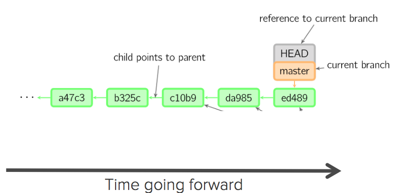
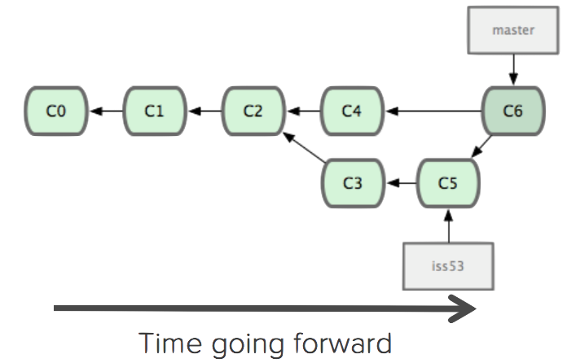
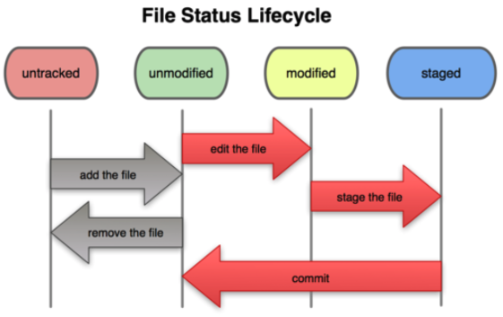

## What is version control?
- A system that keeps records of your changes
- Allows for collaborative development
- Allows you to know who made what changes and when
- **Allows you to revert any changes and go back to a previous state**

## What is version control?
- Distributed version control
- Users keep entire code and history on their location machines
	- Users can make any changes without internet access
	- (Except pushing and pulling changes from a remote server)

## What is git?
- Started in 2005
- Created by Linus Torvald to aid in Linux kernel development
<div class="midcenter" style="margin-left:160px; margin-top:10px;">

</div>

## Other version control systems
- RCS
- Concurrent Versions System (CVS)
- Subversion (SVN)
- Perforce
- Mercurial
- Bazaar
- etc...

## How does git work?
- Can be complicated at first, but there are a few key concepts
- Important git terminology in following slides are <span style="color:blue">blue</span>

## The Git Workflow
The simplest use of git:

- **Modify** file in your <span style="color:blue">working directory</span>
- **Stage** the files, adding snapshots of them to your <span style="color:blue">staging area</span>
- **Commit**, takes files in the staging area and stores that snapshot permanently to your <span style="color:blue">git directory</span> (_.git_)

```{r, eval=FALSE}
  my_working_dir/ <== the working directory
  |-.git/         <== the local repository
  |  |- ...files  <== files/folder git uses to capture the current
  |                   and previous states of the working directory
  |- file1     \
  |- dir1/      | <== files/folders in the working directory
  |  |- file2  /
```

## Key Concepts: <span style="color:blue">Snapshots</span>
- The way git keeps track of your code history
- Essentially records what all your files look like at a given point in time
- You decide when to take a snapshot, and of what files
- Have the ability to go back to visit any snapshot
	- Your snapshots from later on will stay around, too

## Key Concepts: <span style="color:blue">Commit</span>
- The act of creating a snapshot
- Can be a noun or verb
	- “I commited code”
	- “I just made a new commit”
- Essentially, a project is made up of a bunch of commits

## Key Concepts: <span style="color:blue">Commit</span>
- Commits contain three pieces of information:

1. Information about how the files changed from previously
2. A reference to the commit that came before it
	- Called the “<span style="color:blue">parent commit</span>”
3. A <span style="color:blue">hash code</span> name
	- Will look something like:
		f2d2ec5069fc6776c80b3ad6b7cbde3cade4e

## Key Concepts: <span style="color:blue">Repositories</span>
- Often shortened to ‘<span style="color:blue">repo</span>’
- A collection of all the files and the history of those files
	- Consists of all your commits
	- Place where all your hard work is stored

## Key Concepts: <span style="color:blue">Repositories</span>
- Can live on a local machine or on a remote server
- The act of copying a repository from a remote server is called <span style="color:blue">cloning</span>
- Cloning from a remote server allows teams to work together

## Key Concepts: <span style="color:blue">Repositories</span>
- The process of downloading commits that don’t exist on your machine from a remote repository is called <span style="color:blue">pulling</span> changes
- The process of adding your local changes to the remote repository is called <span style="color:blue">pushing</span> changes

## Key Concepts: <span style="color:blue">Branches</span>
- All commits in git live on some branch
- But there can be many, many branches
- The main branch in a project is called the <span style="color:blue">master</span> branch

## So, what does a typical project look like? {.smaller}
- A bunch of commits linked together that live on some branch, contained in a repository


## So, what is <span style="color:blue">HEAD</span>?
-  A reference to the most recent commit
    - (in most cases – not always true!)


## So, what is <span style="color:blue">MASTER</span>?
- The main branch in your project
	- Doesn’t have to be called master, but almost always is


## <span style="color:blue">Branching</span> and <span style="color:blue">Merging</span> {.smaller}

- Create a new <span style="color:blue">branch</span> when making a change while not wanting to break things on the <span style="color:blue">master</span> branch
    - The start of a branch points to a specific <span style="color:blue">commit</span>.
    - Can be called anything
- Once you’re done with your change, you <span style="color:blue">merge</span> it back into master
<div class="midcenter" style="margin-left:-320px; margin-top:-45px;">

</div>

## Key Concepts: How do you make a commit anyway?
- There are a lot of ‘states’ and ‘places’ a file can be
- Local on your computer: the ‘<span style="color:blue">working directory</span>’ or on another computer/server: the '<span style="color:blue">remote</span>'
- When a file is ready to be put in a commit you put it in the ‘<span style="color:blue">staging area</span>’ ('<span style="color:blue">stage the file</span>')

## File states
Files in your working directory can be in four different states in relation to the current commit


## Ok, but how do you actually do it?
You learn linux and do it on the command line:

```{bash, eval=FALSE}
$ mkdir my_project
$ cd my_project
$ git init
$ echo "# README" > README.md
$ git add README.md
$ git commit -m 'Added README.md file'
$ echo "This is my fabulous project" >> README.md
$ git add README.md
$ git commit -m 'Updated README.md' README.md
```

_or using a..._

## Graphical user interface
- SourceTree (_or some other..._)

<div class="midcenter" style="margin-left:-320px; margin-top:-155px;">

</div>

## What is GitHub?
- [www.github.com](http://www.github.com)
- Largest web-based git repository hosting service
	- Hosts ‘remote repositories’
- Allows for code collaboration and **sharing** with anyone online
- Adds extra functionality on top of git
	- UI, documentation, bug tracking, feature requests, pull requests, and more!
<div class="midcenter" style="margin-left: 50px; margin-top: 60px;">

</div>


## Useful git resources (mainly command line) {.smaller}
- Official git site and tutorial: https://git-scm.com/
- GitHub guides: https://guides.github.com/
- Command cheatsheet: https://services.github.com/kit/downloads/github-git-cheat-sheet.pdf
- Interactive git tutorial: https://try.github.io/levels/1/challenges/1
- Visual/interactive cheatsheet: http://ndpsoftware.com/git-cheatsheet.html
- Git Pro book: https://git-scm.com/book/en/v2
- SourceTree documentation: https://confluence.atlassian.com/get-started-with-sourcetree

## Slide source acknowledgements
- Content of these slides based on:
	- Meghan Nelson, Git 101: Git and GitHub for Beginners - http://www.slideshare.net/HubSpot/git-101-git-and-github-for-beginners
	- Rohit Arora, Introduction to Git/Github - A beginner's guide - http://www.slideshare.net/akrish/introduction-to-gitgithub-a-beginners-guide
	- Some figures from: - http://marklodato.github.io/visual-git-guide/index-en.html

# Hands-on session
