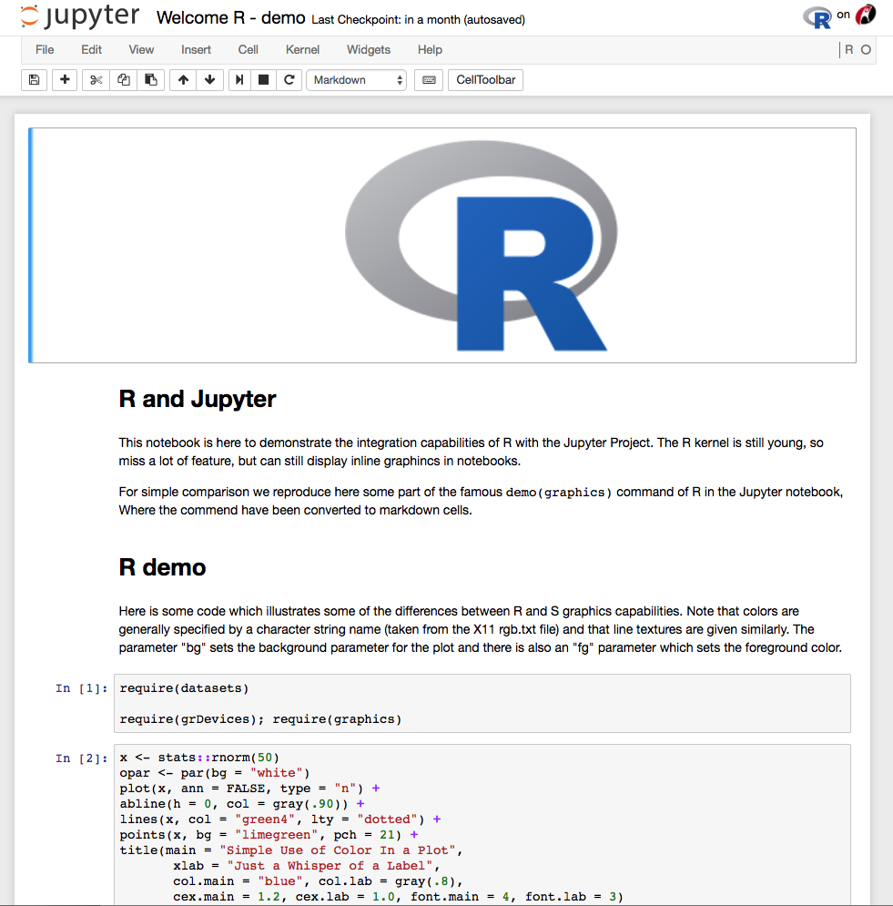
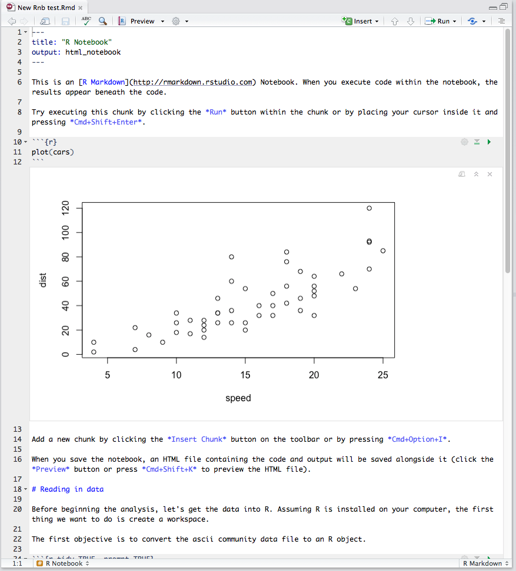

## Why?
- You have to understand what you have done
- Others should be able to reproduce what you have done

## 'Lab notes' - useful practises
- Put in _results_ directory
- Entries dated
- Entries relatively verbose
  - Link to data and code (including versions)
- Embedded images or tables showing results of analysis done
- Observations, Conclusions, and ideas for future work
- Also document analysis that doesn't work, so that it can be understood why you choose a particular way of doing the analysis in the end

## Where to keep notes
- Paper Notebook
- Word processor program / Text files
- Electronic Lab Notebooks
- 'Interactive' Electronic Notebooks
    - e.g. [jupyther](http://jupyter.org/), [R Notebooks](http://rmarkdown.rstudio.com/r_notebooks.html) in RStudio
    - Plain text - work well with version control

  

  
  

  

  
  

## R Notebooks
- 

# Hands-on session
