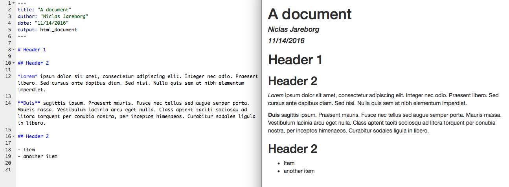
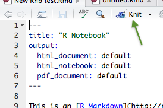
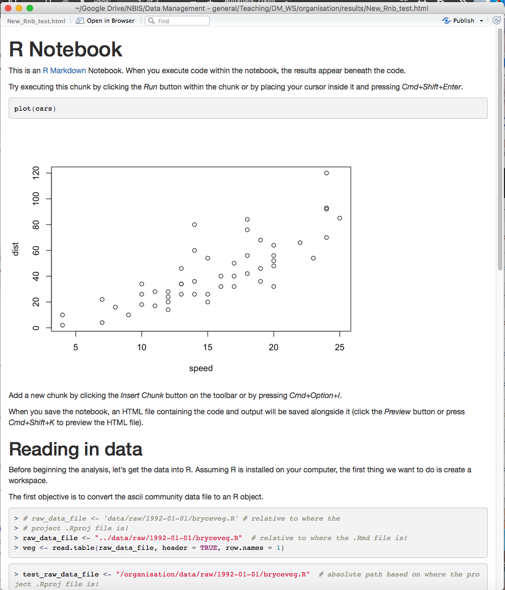
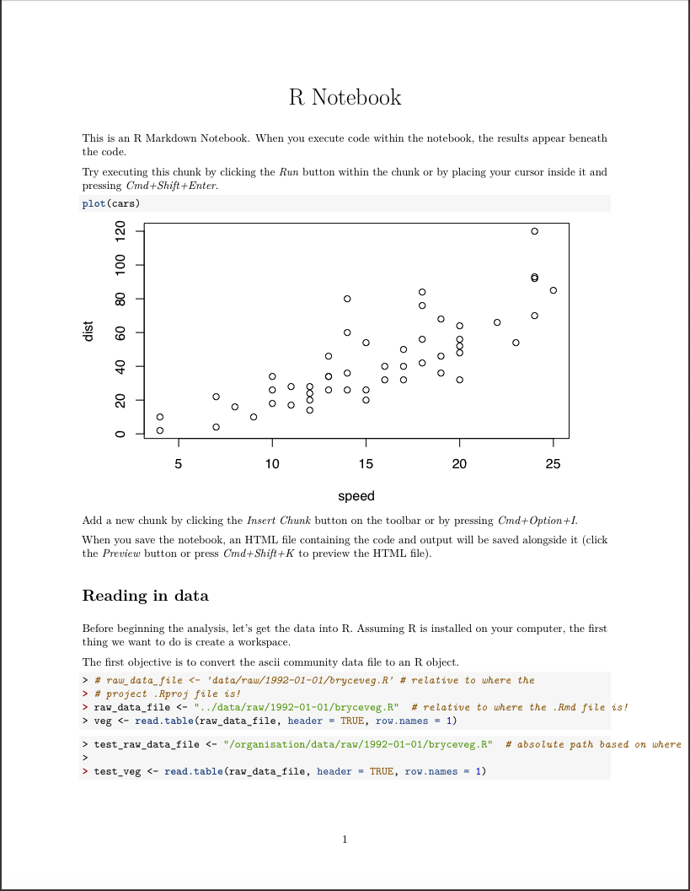

## Why?
- You have to understand what you have done
- Others should be able to reproduce what you have done

## 'Lab notes' - useful practises
- Put in _results_ directory
- Entries dated
- Entries relatively verbose
  - Link to data and code (including versions)
- Embedded images or tables showing results of analysis done
- Observations, Conclusions, and ideas for future work
- Also document analysis that doesn't work, so that it can be understood why you choose a particular way of doing the analysis in the end

## Where to keep notes
- Paper Notebook
- Word processor program / Text files
- Electronic Lab Notebooks
- 'Interactive' Electronic Notebooks
    - e.g. [jupyther](http://jupyter.org/), [R Notebooks](http://rmarkdown.rstudio.com/r_notebooks.html) in RStudio
    - Plain text - work well with version control

## R Notebooks
- RStudio (New File... -> R Notebook)
- Documentation: http://rmarkdown.rstudio.com/r_notebooks.html
- Write in R Markdown
    - Documentation: http://rmarkdown.rstudio.com/lesson-1.html
    - Cheatsheet: https://www.rstudio.com/wp-content/uploads/2016/03/rmarkdown-cheatsheet-2.0.pdf 
    - also _Help->Cheatsheets->R Markdown_ Cheat Sheet in RStudio)
- Embed R and execute code (or bash, Python, SQL, etc)

## R Notebooks
- YAML Header

~~~~~~
---
title: "R Notebook"
output: html_notebook
---
~~~~~~

## R Notebooks
- Text content
    - Markdown

## R Notebooks
- Inline code

## Report formats
- 'Knit' to different output formats
    - html, pdf, word

# Hands-on session
