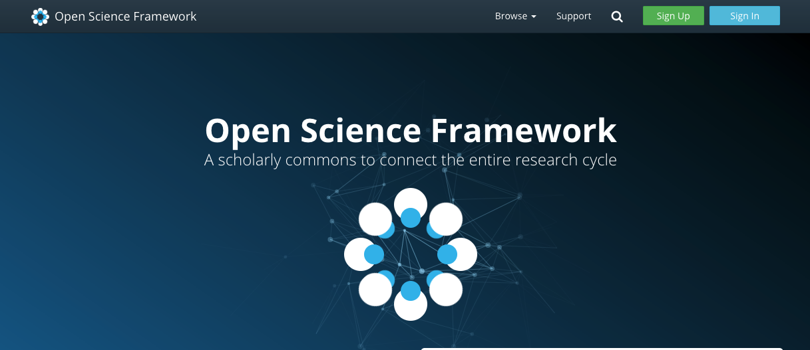
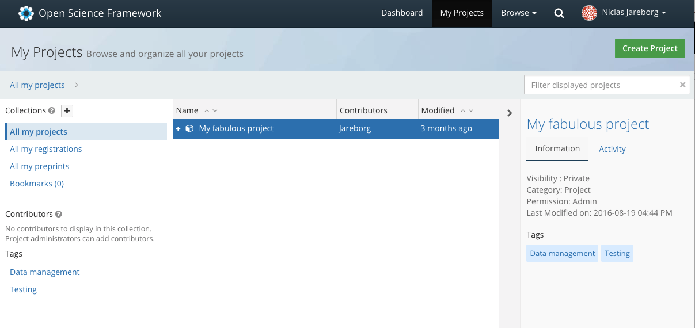
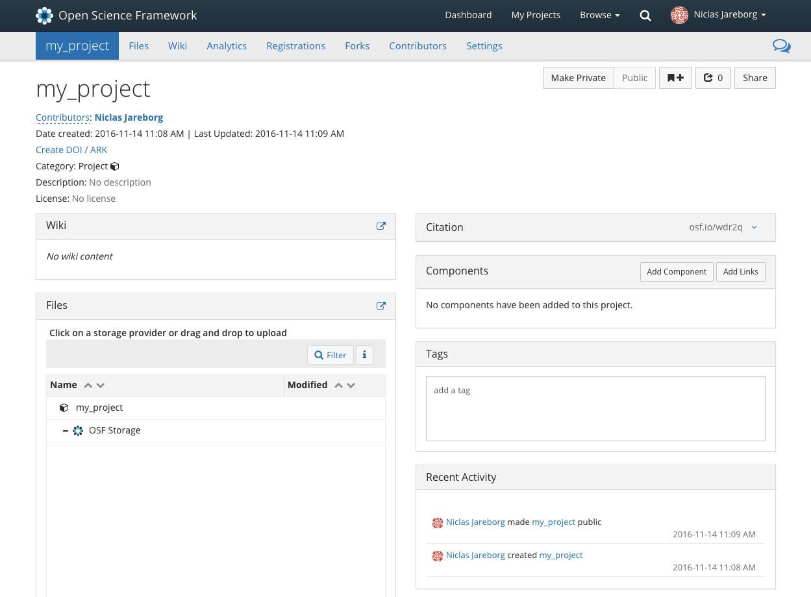
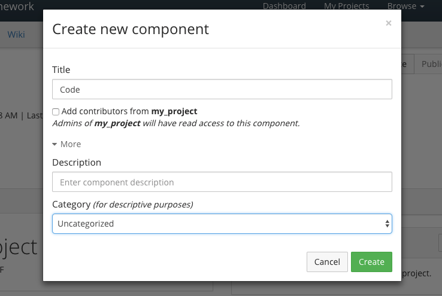
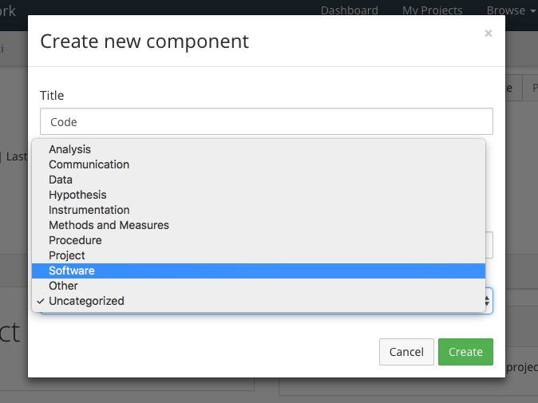
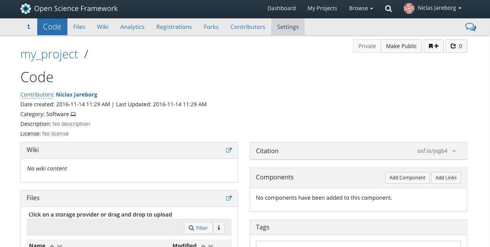
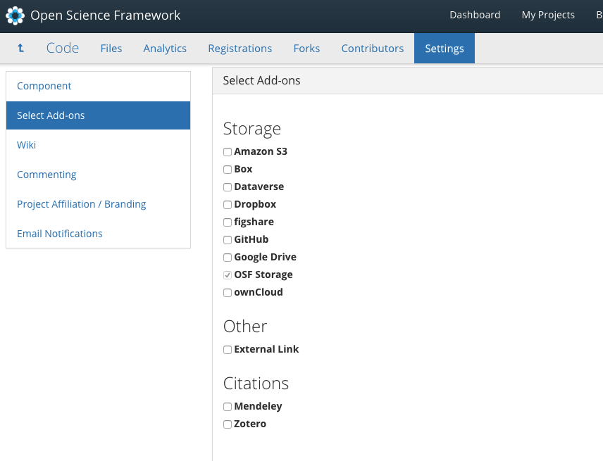
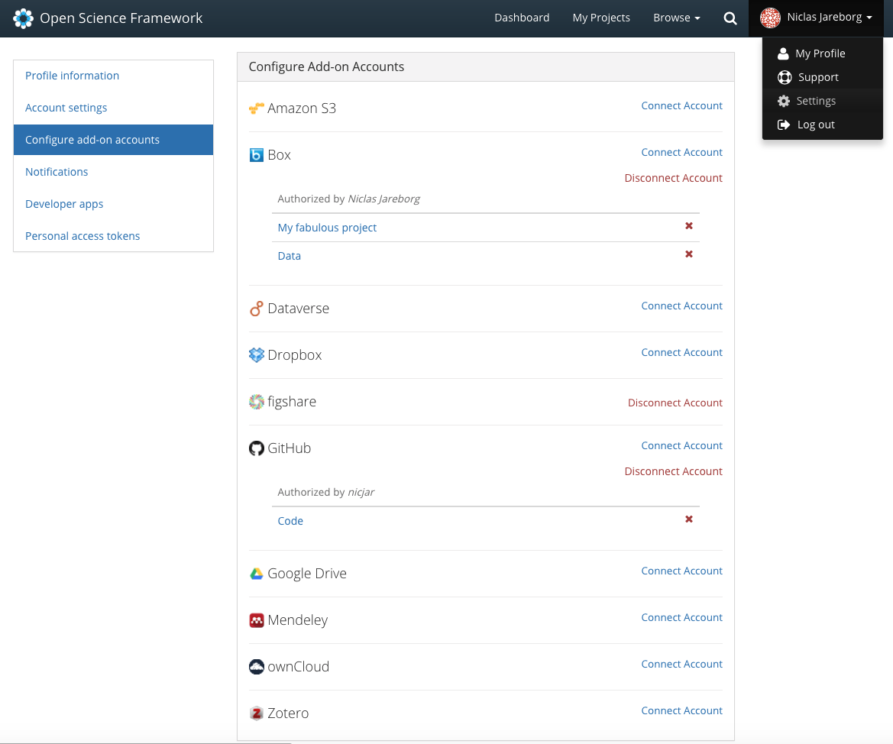
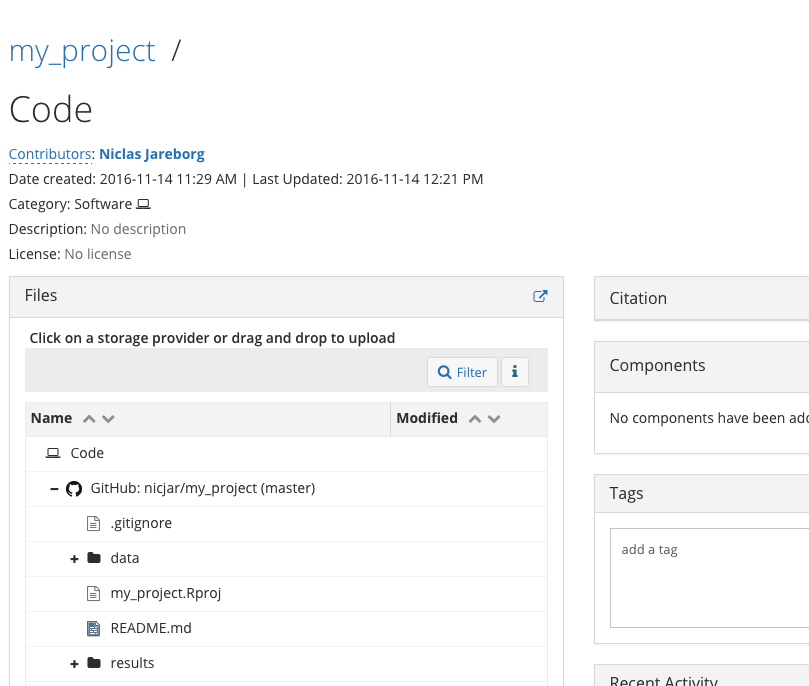

## Why?
- You never truely work alone, right?
    - Collaborators
    - PhD supervisor
    - etc
- Organize and share

## Open Science Framework
- http://osf.io

## OSF - Projects

## OSF - Project page

## Component
- Projects are structured by adding components (projects are components themselves)
- Components can be classified as certain categories

## Component

## Add-ons
- Files etc stored by other third-party tools can be connected to a component

## Configure Add-on accounts

## Connect addon resources

## Component

# Hands-on session
